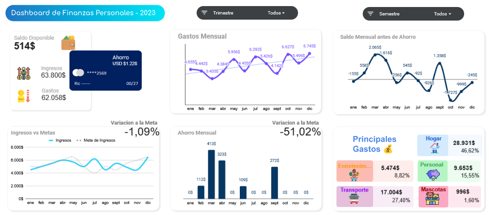
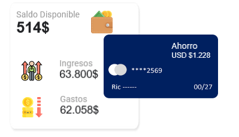

# Control y Análisis de Finanzas Personales

## Descripción

Este proyecto consiste en un sistema de seguimiento y análisis de finanzas personales desarrollado en Google Sheets.

El objetivo es entender el comportamiento de ingresos y gastos, evaluar el cumplimiento de metas financieras y mejorar la toma de decisiones sobre el uso del dinero.

---

## Herramientas

* Google Sheets
* Tablas dinámicas
* Fórmulas y cálculos personalizados

---

## Estructura de los datos

El modelo se compone de 3 componentes principales:

* **Ingresos y Gastos (562 registros):** base transaccional con detalle de movimientos
* **Metas:** objetivos mensuales de ingresos y ahorro
* **Panel de análisis:** tablas dinámicas y cálculos para visualización

---

## Análisis realizado

* Evolución mensual de gastos
* Comparación entre ingresos reales vs metas
* Cálculo de ahorro basado en excedente disponible
* Identificación de principales categorías de gasto
* Análisis del saldo disponible después del ahorro

---

## Visualizaciones

### Evolución de gastos

Permite identificar patrones de consumo a lo largo del tiempo.

### Ingresos vs metas

Compara el desempeño real frente a los objetivos establecidos.

### Ahorro mensual

Muestra la capacidad de generar ahorro en función del ingreso disponible.

### Principales gastos

Identifica en qué categorías se concentra la mayor parte del gasto.

### Saldo disponible

Refleja el dinero restante después de gastos y ahorro.

---

## Insights

* El gasto presenta variaciones mensuales que impactan directamente en la capacidad de ahorro
* No todos los meses se cumplen las metas de ingresos, lo que afecta la planificación financiera
* Algunas categorías concentran una parte significativa del gasto total
* El ahorro depende principalmente del control de gastos más que del aumento de ingresos

---

## Recomendaciones

* Establecer límites de gasto por categoría
* Ajustar metas de ahorro en función del comportamiento real
* Reducir gastos en categorías de bajo valor
* Mantener consistencia en el registro de datos para mejorar el análisis

---

## Filtros

* Trimestre
* Semestre

---

## Vista del Dashboard

## Saldo Disponible, Ingresos, Gastos y Ahorro del año

---

## Acceso al Dashboard

Puedes ver el archivo en Google Sheets aquí:
[Ver dashboard]((https://docs.google.com/spreadsheets/d/11TnSU50x8pS3MGPZmUCBRnhRKIaUeziFK5h4mlLm7Ls/edit?usp=sharing))

---

## Conclusión

Este proyecto muestra cómo, a partir de datos simples, es posible construir una herramienta útil para el control financiero y la toma de decisiones personales.
